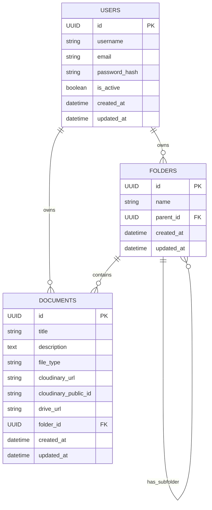

# ERD - Document Manager

## 1. Entity Relationship Diagram

## 2. Entities

### 2.1 User
- `id`: UUID, khóa chính.
- `username`: tên đăng nhập duy nhất.
- `email`: email người dùng.
- `password_hash`: giá trị hash mật khẩu.
- `is_active`: trạng thái kích hoạt.
- `created_at`, `updated_at`: thời điểm tạo/cập nhật.

### 2.2 Folder
- `id`: UUID, khóa chính.
- `name`: tên thư mục.
- `parent_id`: tham chiếu tới folder cha hoặc null.
- `created_at`, `updated_at`.

### 2.3 Document
- `id`: UUID, khóa chính.
- `title`: tiêu đề tài liệu.
- `description`: mô tả tài liệu.
- `file_type`: loại file (pdf, video, mp3, image, website).
- `cloudinary_url`: đường dẫn file trên Cloudinary.
- `cloudinary_public_id`: id file Cloudinary.
- `drive_url`: URL Google Drive nếu nhập từ Drive.
- `folder_id`: tham chiếu tới thư mục chứa.
- `created_at`, `updated_at`.

## 3. Relationships

- Một folder có thể chứa nhiều document.
- Một folder có thể chứa nhiều folder con.
- Một document nằm trong một folder hoặc không nằm trong thư mục nào.
- User được định danh để mở rộng trong tương lai, hiện tại API auth xử lý user nhưng chưa map trực tiếp với document/folder owner trong schema hiện tại.

## 4. Detailed ERD Notes

- `FOLDERS.parent_id` liên kết đệ quy đến `FOLDERS.id`.
- `DOCUMENTS.folder_id` liên kết đến `FOLDERS.id`.
- User table hiện tại chỉ dùng cho xác thực; các tài liệu và thư mục chưa chứa `user_id` trong phiên bản hiện tại, nên hệ thống đi theo mô hình chia sẻ chung cho toàn bộ user nội bộ.
- Nếu mở rộng nhiều user, nên bổ sung trường `owner_id` cho `FOLDERS` và `DOCUMENTS`.
