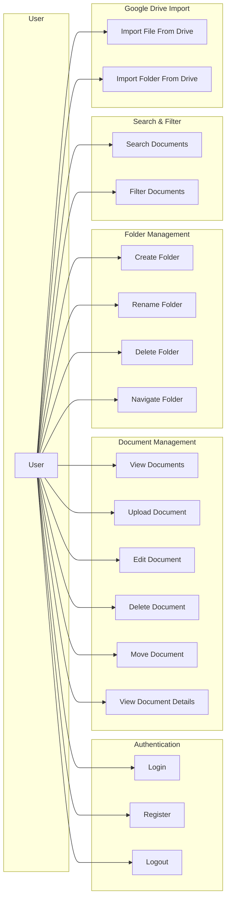
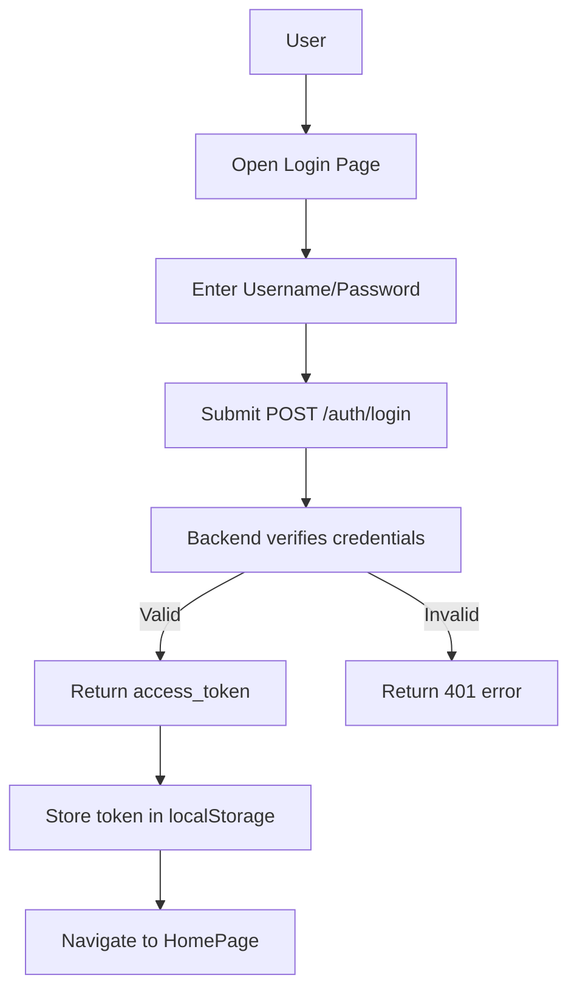
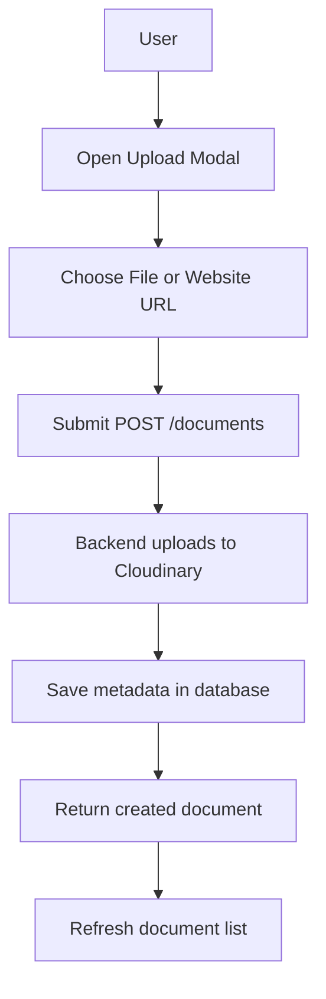
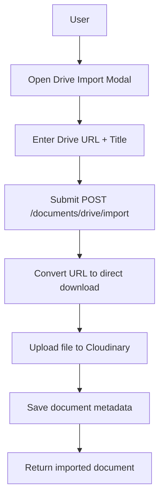
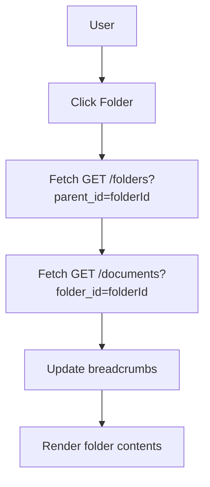

# Use Cases - Document Manager

## 1. Overview

Tài liệu này mô tả các use case chính của hệ thống Document Manager, bao gồm các tác nhân, hành động và luồng xử lý.

## 2. Actors

- **User**: người dùng đã đăng ký hoặc người dùng mới.

## 3. Use Case Diagram

## 4. Use Case Descriptions

### 4.1 Login

**Actor**: User

**Precondition**: Người dùng chưa đăng nhập.

**Trigger**: Người dùng nhập tài khoản và mật khẩu, nhấn nút Đăng nhập.

**Main flow**:
1. Frontend gửi `POST /auth/login` với `username` và `password`.
2. Backend kiểm tra dữ liệu và tìm user trong database.
3. Nếu user tồn tại và mật khẩu đúng, backend tạo `access_token` JWT và trả về.
4. Frontend lưu token vào `localStorage` và chuyển sang trang chính.

**Alternate flow**:
- Nếu username/password sai, backend trả lỗi 401 và frontend hiển thị thông báo lỗi.

### 4.2 Register

**Actor**: User

**Precondition**: Người dùng chưa có tài khoản.

**Trigger**: Người dùng điền form đăng ký và nhấn Đăng ký.

**Main flow**:
1. Frontend gửi `POST /auth/register` với `username`, `password`, `email`.
2. Backend kiểm tra độ dài username/password và tính hợp lệ.
3. Backend kiểm tra username/email chưa tồn tại.
4. Tạo user mới với `password_hash` và trả về token.
5. Frontend lưu token và chuyển vào trang chính.

**Alternate flow**:
- Nếu dữ liệu không hợp lệ hoặc username/email trùng, backend trả lỗi 400 hoặc 409.

### 4.3 Upload Document

**Actor**: User

**Precondition**: User đã đăng nhập.

**Trigger**: Người dùng chọn Upload và nộp dữ liệu tệp hoặc URL website.

**Main flow**:
1. Frontend hiển thị modal upload.
2. Người dùng chọn loại tài liệu và file hoặc nhập website URL.
3. Frontend gửi `POST /documents` với form data.
4. Backend nhận yêu cầu, upload file lên Cloudinary nếu cần, và lưu metadata vào database.
5. Backend trả về document mới.
6. Frontend tải lại danh sách tài liệu.

**Alternate flow**:
- Nếu thiếu file hoặc URL phù hợp, backend trả lỗi 400.
- Nếu upload Cloudinary thất bại, backend trả lỗi 500.

### 4.4 Edit Document

**Actor**: User

**Precondition**: User đã đăng nhập và chọn tài liệu.

**Trigger**: Người dùng sửa tiêu đề, mô tả hoặc chọn thư mục mới.

**Main flow**:
1. Frontend mở modal edit.
2. Người dùng thay đổi dữ liệu và gửi `PUT /documents/{document_id}`.
3. Backend cập nhật trường tương ứng trong database.
4. Backend trả về document đã cập nhật.
5. Frontend cập nhật giao diện.

### 4.5 Delete Document

**Actor**: User

**Precondition**: User đã đăng nhập và chọn tài liệu.

**Trigger**: Người dùng bấm xóa.

**Main flow**:
1. Frontend gọi `DELETE /documents/{document_id}`.
2. Backend tìm tài liệu và xóa metadata.
3. Nếu tài liệu có `cloudinary_public_id`, backend xóa file khỏi Cloudinary.
4. Backend trả về thông báo thành công.
5. Frontend làm mới danh sách tài liệu.

### 4.6 Create Folder

**Actor**: User

**Precondition**: User đã đăng nhập.

**Trigger**: Người dùng bấm tạo thư mục.

**Main flow**:
1. Frontend mở modal tạo thư mục.
2. Người dùng nhập tên và gửi `POST /folders`.
3. Backend lưu folder mới vào database.
4. Frontend cập nhật danh sách thư mục.

### 4.7 Rename Folder

**Actor**: User

**Precondition**: Folder tồn tại.

**Trigger**: Người dùng chọn sửa tên thư mục.

**Main flow**:
1. Frontend gửi `PUT /folders/{folder_id}`.
2. Backend cập nhật tên folder.
3. Backend trả về folder đã cập nhật.
4. Frontend hiển thị tên mới.

### 4.8 Delete Folder

**Actor**: User

**Precondition**: Folder trống (không có tài liệu và không có subfolder).

**Trigger**: Người dùng bấm xóa thư mục.

**Main flow**:
1. Frontend gọi `DELETE /folders/{folder_id}`.
2. Backend kiểm tra nếu folder chứa tài liệu hoặc subfolder.
3. Nếu thư mục trống, backend xóa folder.
4. Frontend cập nhật giao diện.

**Alternate flow**:
- Nếu thư mục không trống, backend trả lỗi 400.

### 4.9 Import File from Google Drive

**Actor**: User

**Precondition**: User đã đăng nhập.

**Trigger**: Người dùng nhập link Drive và nhấn import.

**Main flow**:
1. Frontend gọi `POST /documents/drive/import`.
2. Backend chuyển đổi URL Drive sang direct download.
3. Backend tải file từ Google Drive và upload lên Cloudinary.
4. Backend lưu metadata và trả về document.
5. Frontend cập nhật danh sách.

### 4.10 Import Folder from Google Drive

**Actor**: User

**Precondition**: Backend đã có `GOOGLE_DRIVE_API_KEY`.

**Trigger**: Người dùng nhập URL folder Drive và nhấn import.

**Main flow**:
1. Frontend gọi `POST /documents/drive/import-folder`.
2. Backend lấy danh sách file trong folder Drive.
3. Backend upload từng file lên Cloudinary.
4. Backend trả về số lượng tài liệu đã import.

### 4.11 Search and Filter Documents

**Actor**: User

**Precondition**: User đã đăng nhập.

**Trigger**: Người dùng gõ từ khóa hoặc chọn bộ lọc.

**Main flow**:
1. Frontend lọc các document đã tải xuống theo status.
2. Kết quả hiển thị theo tiêu đề, mô tả và loại file.

## 5. Use Case Flowcharts

### 5.1 Login Flow

### 5.2 Upload Document Flow

### 5.3 Import Drive Flow

### 5.4 Folder Navigation Flow

## 6. Summary

Document Manager hỗ trợ toàn bộ vòng đời tài liệu học tập: quản lý người dùng, nhóm thư mục, upload, edit, delete và import từ Google Drive. Dựa trên kiến trúc frontend/backend, ứng dụng dễ mở rộng và cải tiến thêm các tính năng phân quyền, chia sẻ và pagination.
